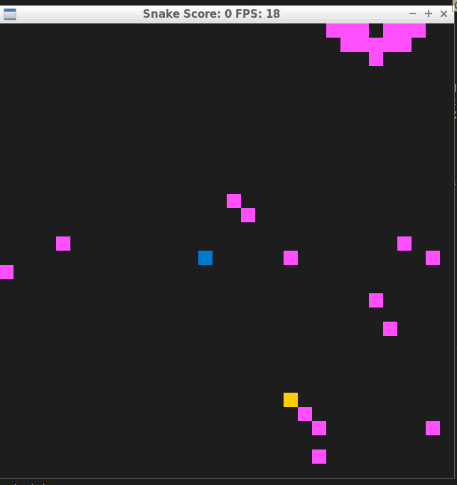

# CPPND: Dijkstra Algorithm adapting to Random Bot

Dijkstra's algorithm is also known as the shortest path algorithm. It is an algorithm used to find the shortest path between nodes of the graph. The algorithm creates the tree of the shortest paths from the starting source vertex from all other points in the graph. It differs from the minimum spanning tree as the shortest distance between two vertices may not be included in all the vertices of the graph. The algorithm works by building a set of nodes that have a minimum distance from the source. Here, Dijkstra's algorithm uses a greedy approach to solve the problem and find the best solution. (Source: https://favtutor.com/blogs/dijkstras-algorithm-cpp )

**Note**: The game is not perfect yet and the aglorithm doesnt yet adapt to the random bot perfectly, but this is a good example concerning good C++ programming practices.

## Dependencies for Running Locally
* cmake >= 3.7
  * All OSes: [click here for installation instructions](https://cmake.org/install/)
* make >= 4.1 (Linux, Mac), 3.81 (Windows)
  * Linux: make is installed by default on most Linux distros
  * Mac: [install Xcode command line tools to get make](https://developer.apple.com/xcode/features/)
  * Windows: [Click here for installation instructions](http://gnuwin32.sourceforge.net/packages/make.htm)
* SDL2 >= 2.0
  * All installation instructions can be found [here](https://wiki.libsdl.org/Installation)
  >Note that for Linux, an `apt` or `apt-get` installation is preferred to building from source. 
* gcc/g++ >= 5.4
  * Linux: gcc / g++ is installed by default on most Linux distros
  * Mac: same deal as make - [install Xcode command line tools](https://developer.apple.com/xcode/features/)
  * Windows: recommend using [MinGW](http://www.mingw.org/)

## Basic Build Instructions

1. Clone this repo.
2. Make a build directory in the top level directory: `mkdir build && cd build`
3. Compile: `cmake .. && make`
4. Run it: `./SnakeGame`.

## Rubrics Completed
* The project demonstrates an understanding of C++ functions and control structures
  > rubric demonstrated in smartbot.cpp and controller.cpp
* The project uses Object Oriented Programming techniques
  > rubric demonstated in smartbot.h, controller.h, controller.cpp and smartbot.cpp where class methods are used
* Classes use appropriate access specifiers for class members.
  > rubric demonstated in smartbot.h and controller.h where access specifiers are used
* The project uses destructors appropriately.
  > Node in smartbot.cpp has its own class destructor which clears the vectors at destruction, thereby freeing the memory.
* The project uses smart pointers instead of raw pointers.
  > bot is a smart pointer declared and used in game.h and game.cpp

## CC Attribution-ShareAlike 4.0 International

Shield: [![CC BY-SA 4.0][cc-by-sa-shield]][cc-by-sa]

This work is licensed under a
[Creative Commons Attribution-ShareAlike 4.0 International License][cc-by-sa].

[![CC BY-SA 4.0][cc-by-sa-image]][cc-by-sa]

[cc-by-sa]: http://creativecommons.org/licenses/by-sa/4.0/
[cc-by-sa-image]: https://licensebuttons.net/l/by-sa/4.0/88x31.png
[cc-by-sa-shield]: https://img.shields.io/badge/License-CC%20BY--SA%204.0-lightgrey.svg
